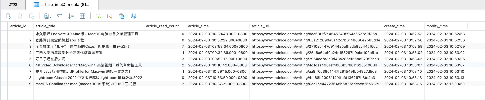

# mdnice网址内容爬取:

本项目仅用于爬虫研究，目的以 `mdnice.com` 为例，学习利用 Scrapy 进行 HTML 标签抽取，标题提取、跳转后的网页提取、跳转后网页显示的阅读数提取。<br>

内容示意图如下:<br>

[](./mdnice_intro.jpg)


## 复制完整的HTML(Mac版、以Chrome举例):

1. 打开你想要复制HTML的网页。

2. 使用快捷键 `Option + Command + I` 打开 **开发者工具**。

3. 在开发者工具中，你会看到HTML源代码的树形结构。一般情况下，`<html>` 标签会是这棵树的根节点。

4. 右键点击<html>标签，选择“Copy”>Copy outerHTML。

这样就会复制整个网页的HTML代码到剪贴板中。<br>


## 终端测试效果(可选):

可以终端输入以下指令，简单查看 Scrapy 从网页抓取到的内容，然后选择要提取的内容，帮助自己更好完成自己的爬虫文件:<br>

```bash
scrapy shell 'https://www.mdnice.com/'
```

例如在 scrapy shell 中输入以下指令查看效果:<br>

```bash
response.xpath('//script[@id="__NEXT_DATA__"]/text()').get()
```


## 爬取需要的结果:

```python
import scrapy
import json
from datetime import datetime, timedelta, timezone

class MdniceSpider(scrapy.Spider):
    name = 'mdnice'
    start_urls = ['https://www.mdnice.com/']

    def parse(self, response):
        json_data = response.xpath('//script[@id="__NEXT_DATA__"]/text()').get()
        data = json.loads(json_data)

        articles = data['props']['pageProps']['list']
        for article in articles:
            out_id = article['outId']
            title = article['title']
            url = f"https://www.mdnice.com/writing/{out_id}"
            create_time_str = article['createTime']

            # 解析ISO 8601格式时间字符串，包括时区信息
            create_time = datetime.strptime(create_time_str, "%Y-%m-%dT%H:%M:%S.%f%z")

            # 获取当前时间（考虑到时区）
            current_time = datetime.now(timezone.utc)

            # 计算时间差
            time_difference = current_time - create_time

            # 判断文章是否在过去2小时内创建
            if time_difference <= timedelta(hours=20):
                # 使用meta传递额外数据
                yield scrapy.Request(url, callback=self.parse_article, meta={'title': title, 'create_time': create_time_str})

    def parse_article(self, response):
        # 从meta中提取传递的数据
        title = response.meta['title']
        create_time = response.meta['create_time']

        # 提取阅读次数
        script = response.xpath("//script[@id='__NEXT_DATA__']/text()").get()
        # 解析 JSON 数据
        data = json.loads(script)
        # 提取 readingNum 字段
        reading_num = data["props"]["pageProps"]["writingDetail"]["readingNum"]
        
        yield {
            'title': title,
            'create_time': create_time,
            'url': response.url,
            'read_count': reading_num
        }
```

## 礼貌爬取:

通常，你需要更礼貌的爬取数据，才能不被禁掉IP、限制访问。可以参考以下写法。<br>

### 设置固定的下载延迟（DOWNLOAD_DELAY）：

在 `settings.py` 文件中添加以下内容，这种方法适用于你想要在每次请求之间强制等待固定时间的情况，例如每2秒发送一个请求。这样做可以简单粗暴地限制请求速度，减少对目标网站的压力。<br>

```conf
# settings.py

# 设置下载延迟为2秒
DOWNLOAD_DELAY = 2
```

### 启用自动限速（AUTOTHROTTLE）：

在 `settings.py` 文件中添加以下内容，这种方法更为智能，它会根据服务器的响应时间动态调整请求间的延迟，以找到最优的爬取速度。这不仅可以保护目标网站不被过度请求影响，还可以在允许的情况下提高爬虫的效率。<br>

```conf
# settings.py

# 启用自动限速
AUTOTHROTTLE_ENABLED = True
# 初始下载延迟
AUTOTHROTTLE_START_DELAY = 2
# 最大下载延迟，防止延迟过长
AUTOTHROTTLE_MAX_DELAY = 60
# 启用显示自动限速的调试信息
AUTOTHROTTLE_DEBUG = True
```

爬取数据时，可以将这两个方案结合使用，通常会得到更好的效果。<br>

结合使用这两种方法可以让你的爬虫既有一个基本的请求间隔保障（通过DOWNLOAD_DELAY），又能够智能地调整速度以应对不同的服务器响应情况（通过AUTOTHROTTLE）。<br>

例如，你可以设置一个相对较小的DOWNLOAD_DELAY作为基线，然后启用AUTOTHROTTLE来允许Scrapy在这个基线的基础上根据实际的响应情况进行调整。<br>

这样做的好处是，即使在服务器响应较慢或者网络条件变化的情况下，你的爬虫也能够自适应地调整请求速度，避免对服务器造成不必要的负担，同时尽可能地提高爬取效率。<br>


## 执行自己的pipelines:

我们通常需要对自己爬取的数据进行一些额外的处理，例如将爬取的结果存入MongoDB、MySQL。存入MongoDB的示例官方已经给出，这里仿照官方示例实现将爬取的数据存入MySQL:<br>

### 修改 pipelines.py:

找到当前Scrapy项目文件夹下的 `pipelines.py` 文件，然后写入以下内容:<br>

```python
import pymysql
from itemadapter import ItemAdapter

import time

def current_timestamp():
    """返回当前日期时间的字符串表示形式,格式为: 2023-08-15 11:29:22 """
    return time.strftime("%Y-%m-%d %H:%M:%S", time.localtime())

class MdnicePipeline:
    def process_item(self, item, spider):
        return item

class MySQLPipeline:
    """
    A pipeline to store the item in a MySQL database.
    """

    def __init__(self, mysql_host, mysql_db, mysql_user, mysql_password):
        self.mysql_host = mysql_host
        self.mysql_db = mysql_db
        self.mysql_user = mysql_user
        self.mysql_password = mysql_password

    @classmethod
    def from_crawler(cls, crawler):
        return cls(
            mysql_host=crawler.settings.get('MYSQL_HOST'),
            mysql_db=crawler.settings.get('MYSQL_DBNAME'),
            mysql_user=crawler.settings.get('MYSQL_USER'),
            mysql_password=crawler.settings.get('MYSQL_PASSWORD'),
        )

    def open_spider(self, spider):
        self.connection = pymysql.connect(host=self.mysql_host,
                                        user=self.mysql_user,
                                        password=self.mysql_password,
                                        database=self.mysql_db,
                                        charset='utf8mb4',
                                        cursorclass=pymysql.cursors.DictCursor)
        self.cursor = self.connection.cursor()

        # 检查表是否存在，如果不存在则创建
        self.cursor.execute("""
            CREATE TABLE IF NOT EXISTS article_info (
                article_id INT AUTO_INCREMENT PRIMARY KEY COMMENT '文章的唯一ID',
                article_title VARCHAR(255) NOT NULL COMMENT '文章标题',
                article_read_count INT NOT NULL COMMENT '文章阅读数',
                article_time VARCHAR(255) NOT NULL COMMENT '文章发表时间',
                article_url VARCHAR(255) NOT NULL COMMENT '文章具体链接',
                create_time TIMESTAMP DEFAULT CURRENT_TIMESTAMP COMMENT '创建时间',
                modify_time TIMESTAMP DEFAULT CURRENT_TIMESTAMP ON UPDATE CURRENT_TIMESTAMP COMMENT '修改时间'
            ) CHARSET=utf8mb4;
        """)
        self.connection.commit()

    def close_spider(self, spider):
        self.connection.close()

    def process_item(self, item, spider):
        # 构建插入数据的SQL语句，现在包括create_time和modify_time字段
        sql = """
        INSERT INTO article_info (article_title, article_read_count, article_time, article_url, create_time, modify_time) 
        VALUES (%s, %s, %s, %s, %s, %s)
        """
        # 准备插入数据的值，确保顺序与上面的SQL语句中的列对应
        values = (
            item.get('title'), 
            item.get('read_count'), 
            item.get('create_time'), 
            item.get('url'),
            current_timestamp(),  # 使用函数生成插入记录的当前时间
            current_timestamp(),  # 同上
        )
        
        try:
            # 执行SQL语句
            self.cursor.execute(sql, values)
            # 提交到数据库执行
            self.connection.commit()
        except pymysql.MySQLError as e:
            # 如果发生错误则回滚
            print(e)
            self.connection.rollback()
        
        return item
```

可能有人迷惑，代码中不需要用到 `ItemAdapter` 吗？Scrapy的官方示例明明就使用了 `ItemAdapter` 。<br>

这是因为，在Scrapy项目中，`ItemAdapter` 用于提供一个统一的API来处理不同类型的数据项（如dict、Item、Dataclass等），这使得在处理数据时更加灵活。<br>

在笔者的情况下，因为笔者直接从item字典中获取值，使用ItemAdapter并不是必须的。当然，引入 `ItemAdapter` 可以让代码更加健壮和灵活，尤其是当你需要处理多种类型的数据项或计划在不同的环境下重用这些代码时。<br>

如果你想使用 `ItemAdapter` ，可以这样修改 `process_item` 方法：<br>

```python
from itemadapter import ItemAdapter

class MySQLPipeline:

    # 省略前面的代码，和上文使用常规方法的代码一致。

    def process_item(self, item, spider):
        adapter = ItemAdapter(item)
        # 构建插入数据的SQL语句
        sql = """
        INSERT INTO article_info (article_title, article_read_count, article_time, article_url) 
        VALUES (%s, %s, %s, %s)
        """
        # 使用ItemAdapter获取item值，提高代码兼容性
        values = (
            adapter.get('title'), 
            adapter.get('read_count'), 
            adapter.get('create_time'), 
            adapter.get('url')
        )
        
        try:
            # 执行SQL语句
            self.cursor.execute(sql, values)
            # 提交到数据库执行
            self.connection.commit()
        except pymysql.MySQLError as e:
            # 如果发生错误则回滚
            print(e)
            self.connection.rollback()
        
        return item

```

### 拓展--pipelines中的函数名:

再说另一个疑问点，可能有人会问 "pipelines中的函数名有讲究吗？"，是有什么固定的写法吗？<br>

答案: 是的，是有固定写法。<br>

解释:<br>

在Scrapy框架中，`pipelines.py` 文件用于处理数据管道（Pipelines），这是Scrapy的一个重要组成部分，用于处理从爬虫（Spiders）那里获取的数据项（Items）。在`pipelines.py`中定义的类可以对数据进行处理，如清洗、验证、存储（比如存入数据库）等。Scrapy的数据管道支持定制多个处理步骤，每个步骤由一个Pipeline类实现。下面是一些Scrapy管道中常见的函数及其用途：<br>

1. `process_item(self, item, spider)`:
   - 这是Pipeline中最重要的方法，每个Item爬取完成后都会自动调用此方法。
   - 参数`item`是被爬取的item。
   - 参数`spider`是爬取此item的spider。
   - 此方法必须返回一个具有数据的item对象‼️，或者是`DropItem`异常，后者将中止当前item的处理。

2. `open_spider(self, spider)`:
   - 当spider被开启时，这个方法被调用。
   - 用于进行一些初始化工作，比如在数据库管道中连接数据库。

3. `close_spider(self, spider)`:
   - 当spider被关闭时，这个方法被调用。
   - 用于进行一些清理工作，比如关闭数据库连接。

4. `from_crawler(cls, crawler)`:
   - 这是一个类方法，用于创建Pipeline实例。
   - 参数`crawler`是Crawler对象，可以从中访问Scrapy的配置以及其他核心组件，如信号（signals）。
   - 通常用于通过`crawler.settings`获取Scrapy设置来配置Pipeline。

管道中的函数名（比如`process_item`, `open_spider`, `close_spider`）遵循Scrapy的预定义约定。Scrapy框架在运行时会自动调用这些方法，因此必须按照约定定义它们，以确保Scrapy框架可以正确地与你的Pipeline交互。<br>

在笔者的`MySQLPipeline`类中，`open_spider`方法用于在爬虫开始时连接MySQL数据库，并创建表（如果表不存在）。`process_item`方法则用于处理每个item，并将其存储到MySQL数据库中。最后，`close_spider`方法在爬虫关闭时断开数据库连接。这样的结构使得数据处理逻辑清晰且易于维护。<br>

### settings.py 添加数据库配置:

找到当前Scrapy项目文件夹下的 `settings.py` 文件，然后写入以下内容:<br>

> 可以任意找一个位置写入下列内容，也可以执行前先搜索官方是否有注释部分，写入相关部分。

```conf
# MySQL数据库连接配置
MYSQL_HOST = '8.140.203.xxx'
MYSQL_DBNAME = 'irmdata'
MYSQL_USER = 'root'
MYSQL_PASSWORD = 'Flameaway3.'
MYSQL_PORT = 3306  # 默认MySQL端口是3306
```

### settings.py 添加pipelines执行优先级:

🚨必须在 `settings.py` 中添加 `pipelines.py` 定的优先级才能在执行数据爬取后，执行自己的 pipelines。<br>

根据自己定义的pipelines的文件名，在 `settings.py` 中添加类似如下内容:<br>

```conf
# 开启自己的pipeline
ITEM_PIPELINES = {
   "mdnice.pipelines.MySQLPipeline": 300,
}
```

## 运行方式:

现在一切准备就绪，可以终端执行以下指令进行数据爬取操作:<br>

```bash
scrapy crawl mdnice
```

数据爬取后自动将数据写入MySQL，效果如下:<br>

